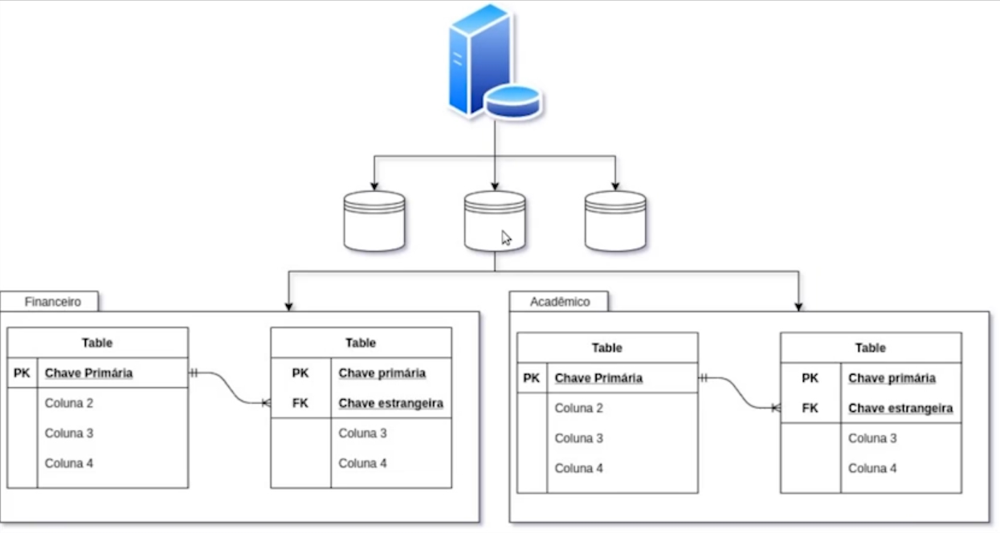
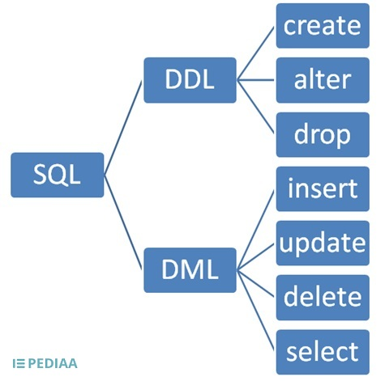

# PostgreSQL: comandos DML e DDL

Aprendendo mais sobre a modelagem de um banco relacional; diferença entre DDL e DML; entendendo o que é o schema no banco; usando importação para popular o banco; trabalhando com transações com Commit e Rollback;
utilizando sequências e tipos personalizados do banco.

1. [Modelagem de Dados](#1-modelagem-de-dados)
2. [Estrutura do banco](#2-estrutura-do-banco)
3. [Inclusão de Dados](#3-inclusão-de-dados)
4. [Alteração de Dados](#4-alteração-de-dados)
5. [Particularidades PostgreSQL](#5-particularidades-postgresql)

Saiba mais sobre o curso [aqui](https://cursos.alura.com.br/course/pgsql-comandos-dml-ddl) ou acompanhe minhas anotações abaixo. ⬇️

## 1. Modelagem de Dados

### **Schemas**

O `SCHEMA` no banco de dados funciona como o setor de uma empresa. Pode-se dividir os setores em financeiro, acadêmico, operacional e, também, pode-se fazer o mesmo com os esquemas.



A sintaxe para criar um esquema é a seguinte:

```sql
CREATE SCHEMA academico;
```

***Qual o propósito dos schemas no PostgreSQL?***

    Organizar (e separar) de forma lógica nossas tabelas

> Uma analogia ao mundo da programação seriam os módulos, pacotes ou namespaces. Uma analogia ao mundo dos Sistemas Operacionais seriam as pastas. Schemas servem para organizar e separar nossas tabelas.

### **Análise de requisitos**

A análise de requisitos precede a criação do banco de dados, pois é nela que se faz a modelagem de dados. Existem ferramentas para auxiliar nessa tarefa e elas são chamadas de CASE. Saiba mais sobre o que essas ferramentas fazem [aqui](Para%20saber%20mais/Aula%201%20-%20Atividade%207%20Para%20saber%20mais_%20CASE.pdf).

## 2. Estrutura do banco

### **Criando um banco**

O ponto de partida para a criação do banco é a criação do banco propriamente dito. Nele serão criados os esquemas, as tabelas e os registros serão inseridos.

    DATABASE > SCHEMA > TABLE > COLUMN

A sintaxe básica para criar um banco de dados é a seguinte:

```sql
CREATE DATABASE alura;
```

### **Definições em tabelas**

As definições são características (restrições ou constraints) que se adiciona na criação das tabelas para que os campos recebam configurações de uso. A exemplo da chave primária que habilita um campo a ser relacionado com outra tabela ou o not null que impede a inclusão e dados nulos, ou seja, todos os dados devem ser inseridos.

***Algumas definições:***

- `IF NOT EXISTS` utilizada na criação da tabela para checar se já ela existe
- `DEFAULT` cria um valor padrão para determinado campo
- `CHECK` verifica se um campo é equivalente ao que se pede ou não
- `UNIQUE` especifica que os registros não podem ser repetidos nos campos

```sql
CREATE TEMPORARY TABLE a (
	coluna1 VARCHAR(255) NOT NULL CHECK(coluna1 <> ''),
	coluna2 VARCHAR(255) NOT NULL,
	UNIQUE (coluna1, coluna2)
);

-- retorna erro, pois a tabela impede inserção de valores nulos
INSERT INTO a VALUES (NULL);

-- retorna erro, pois verifica se o valores inseridos são diferentes de uma string vazia
INSERT INTO a VALUES ('');

-- insere valores únicos na tabela que não poderá ser repetidos
INSERT INTO a VALUES ('a', 'b');
-- retorna erro na inserção, pois os valores são iguais
INSERT INTO a VALUES ('a', 'b');
-- não retorna erro na inserção, pois um dos valores já não é igual ao da primeira inserção
INSERT INTO a VALUES ('a', 'c');
```

Para saber mais sobre diferença entre definições de tabelas e colunas, acesse o [esse](Para%20saber%20mais/Aula%202%20-%20Atividade%204%20Para%20saber%20mais_%20Table%20vs%20Column%20Constraints.pdf) arquivo.

### **Alterando informações**

Além de criar, é possível alterar informações das tabelas, colunas e registros de um banco. A linguagem SQL é dividida em tipos de acordo com a funcionalidade dos comandos.

    DDL é a linguagem de definição de dados e utiliza os comandos CREATE, ALTER, DROP.
    DML é a linguagem de manipulação de dados e utiliza os comandos INSERT, UPDATE, DELETE.



***Alterando o nome da tabela e das colunas:***

```sql
ALTER TABLE a RENAME TO teste;

SELECT * FROM teste;

ALTER TABLE teste RENAME coluna1 TO primeira_coluna;
ALTER TABLE teste RENAME coluna2 TO segunda_coluna;
```

***Outros subconjuntos da linguagem SQL:***


Acesse [aqui](https://www.devmedia.com.br/guia/guia-completo-de-sql/38314) para conhecer outros subconjuntos da linguagem SQL e qual o propósito de cada um.

## 3. Inclusão de Dados

No PostgreSQL, para incluir de registros nas tabelas, utiliza-se as simples. Para nomear ou renomear uma coluna da tabela, utiliza-se aspas duplas.

    Aspas simples delimitam valores.
    Aspas duplas definem nomes de colunas.

```sql
CREATE TABLE teste ("Primeira Coluna", segunda_coluna);
INSERT INTO teste VALUES ('a', '1987-03-16');
SELECT primeira_coluna AS "Primeira Coluna" FROM teste;
```

Assim como as strings, alguns valores numéricos também possuem regras. Valores decimais recebem ponto, não vírgula, pois estão no padrão americano e para não confundir com a vírgula da separação de valores.

    Vírgula não delimita números decimais.
    Vírgula separa os campos e registros desses campos.
    Ponto delimita números decimais, seja flutuante ou real.

```sql
INSERT INTO teste VALUES (1.57, 63.5);  -- altura, peso
INSERT INTO teste VALUES (8.6);         -- nota, média
INSERT INTO teste VALUES (199,90);      -- preço
```

### **INSERT SELECT**

Uma consulta pode ser utilizada para inserir dados em uma tabela. Ao passo que os registros que se quer adicionar em uma tabela já existam, não é necessário inseri-los manualmente, pode apenas inserir a partir de uma consulta.

```sql
CREATE TEMPORARY TABLE cursos_programacao (
	id_curso INTEGER PRIMARY KEY,
	nome_curso VARCHAR(255) NOT NULL
);

INSERT INTO cursos_programacao
	SELECT academico.curso.id, academico.curso.nome
	FROM academico.curso
	WHERE categoria_id = 2;

SELECT * FROM cursos_programacao;
```

## 4. Alteração de Dados

### **UPDATE FROM**

O comando `UPDATE FROM` atualiza uma tabela com dados de outra.

```sql
SELECT * FROM academico.curso;

-- atualiza a tabela de cursos
UPDATE academico.curso SET nome = 'PHP Básico' WHERE id = 4;
UPDATE academico.curso SET nome = 'Java Básico' WHERE id = 5;
UPDATE academico.curso SET nome = 'C++ Básico' WHERE id = 6;

SELECT * FROM academico.curso ORDER BY 1;

SELECT * FROM teste.cursos_programacao;

-- atualiza a tabela de cursos de programação a partir dos registros da tabela de cursos
UPDATE teste.cursos_programacao
SET nome_curso = nome
FROM academico.curso
WHERE teste.cursos_programacao.id_curso = academico.curso.id;

SELECT * FROM teste.cursos_programacao ORDER BY 1;
```

### **Cuidados**

É preciso tomar muito cuidado com o comando `DELETE` para não excluir coisas importantes e/ou tudo de uma tabela. Com o comando `UPDATE` deve-se ter cuidado também para que não atualize o registro errado.

***Para resolver isso existe um mantra muito popular no SQL:***

    NUNCA FAÇA DELETE SEM WHERE
    NUNCA FAÇA DELETE SEM WHERE
    NUNCA FAÇA DELETE SEM WHERE

É preciso dizer o que se quer excluir ou atualizar para que erros assim não aconteçam. Contudo, a etapa principal antes de realizar qualquer um desses comandos é usar o `SELECT` com o mesmo filtro para verificar antes se, de fato, está selecionando o registro certo.

### **Transações**

> Transação é uma unidade lógica de processamento que tem por objetivo preservar a integridade e a consistência dos dados. Esse processamento pode ser executado todo ou não garantindo a atomicidade das informações.

- `BEGIN` inicia a transação
- `COMMIT` finaliza a transação de forma positiva
- `ROLLBACK` finalizando a transação cancelando o comando
- `END` finaliza a transação assim como o commit

***Iniciando e parando uma transação:***

```sql
BEGIN
-- os comandos select, update, delete vem aqui
COMMIT
ROLLBACK
END
```

Para conhecer um pouco mais sobre transações no PostgreSQL, leia [este](https://www.devmedia.com.br/transacoes-no-postgresql-niveis-de-isolamento/32464) artigo do Devmedia e a documentação do próprio PostgreSQL, [aqui](https://www.postgresql.org/docs/current/tutorial-transactions.html).

## 5. Particularidades PostgreSQL

### **Sequências**

> Esse objeto produz uma seqüência numérica auto-incremento, que será sempre única, independente do contexto transacional. O valor gerado permanece associado ao nome do objeto seqüência.

```sql
-- uso do serial
CREATE TEMPORARY TABLE auto (
	id SERIAL PRIMARY KEY,
	nome VARCHAR(30) NOT NULL
);

-- uso da sequência
CREATE SEQUENCE eu_criei;

CREATE TEMPORARY TABLE auto (
	id INTEGER PRIMARY KEY DEFAULT NEXTVAL('id_auto'),
	nome VARCHAR(30) NOT NULL
);

SELECT NEXTVAL('eu_criei');
```

***Funções de uma sequência:***

- `NEXTVAL` incrementa a sequência em uma unidade e retorna o valor
- `CURRVAL` recupera o último valor geral por NEXTVAL na sessão
- `SETVAL` altera o valor da sequência

> Um campo serial é um campo integer associado a uma seqüência. Assim, o nome da sequência criada pelo tipo serial é composto por `nome-da-tabela_nome-da-coluna_seq`.

Resumindo, o `SERIAL` executa "por baixo dos panos" o mesmo que a `SEQUENCE` executa manualmente.

O artigo da SQL Magazine 7, da Devmedia, explica mais sobre os tipos de dados e sequência no PostgreSQL. [Confira](https://www.devmedia.com.br/artigo-sql-magazine-7-tipos-de-dados-e-sequencias-no-postgreesql/5117)!

### **Tipos**

Segundo a descrição na documentação, o comando `CREATE TYPE` registra um novo tipo de dados para uso no banco de dados atual. Para saber mais sobre como criar tipos confira a documentação [aqui](https://www.postgresql.org/docs/current/sql-createtype.html).

> O nome do tipo deve ser diferente do nome de qualquer tipo ou domínio existente no mesmo esquema. (Como as tabelas têm tipos de dados associados, o nome do tipo também deve ser diferente do nome de qualquer tabela existente no mesmo esquema.)

***Os tipos podem ser criados das formas a seguir:***

- CREATE TYPE name
- CREATE TYPE name (...)
- CREATE TYPE name AS ... (...)
- CREATE TYPE name AS ENUM (...)
- CREATE TYPE name AS RANGE (...)

```sql
-- criando uma tabbela com check para classificação indicativa de filme
CREATE TEMPORARY TABLE filme (
	id SERIAL PRIMARY KEY,
	nome VARCHAR(255) NOT NULL,
	classificacao VARCHAR(255) CHECK (
        classificacao IN ('LIVRE', '12_ANOS', '14_ANOS', '16_ANOS', '18_ANOS')
    )
);


-- substituindo o check por ENUM
CREATE TEMPORARY TABLE filme (
	id SERIAL PRIMARY KEY,
	nome VARCHAR(255) NOT NULL,
	classificacao ENUM (
		'LIVRE', '12_ANOS', '14_ANOS', '16_ANOS', '18_ANOS'
	)
);


-- substituindo o ENUM pela criação de tipo
CREATE TYPE CLASSIFICACAO AS ENUM (
	'LIVRE', '12_ANOS', '14_ANOS', '16_ANOS', '18_ANOS'
);

CREATE TEMPORARY TABLE filme (
	id SERIAL PRIMARY KEY,
	nome VARCHAR(255) NOT NULL,
	classificacao CLASSIFICACAO
);

INSERT INTO filme (nome, classificacao)
VALUES
	('Um filme qualquer', 'Teste') -- acusa erro, não existe essa classificação
	('Um filme qualquer', '18_ANOS')
```

***Sobre o comando `ENUM` utilizado ao invés do `CHECK` nos exemplos acima:***

> `ENUM` são tipos de dados que compreendem um conjunto de valores estáticos e ordenados.
> Um exemplo de ENUM pode ser os dias da semana ou um conjunto de valores de status para um dado.

⬆️ [Voltar ao topo](#postgresql-comandos-dml-e-ddl) ⬆️